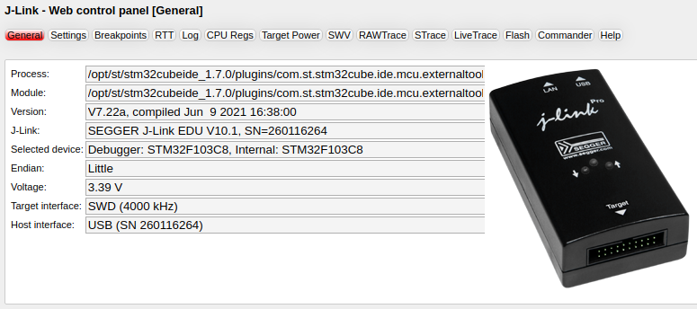
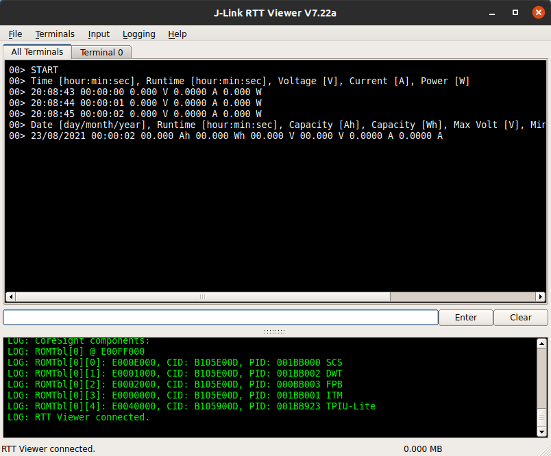
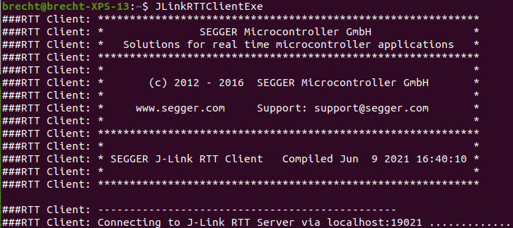
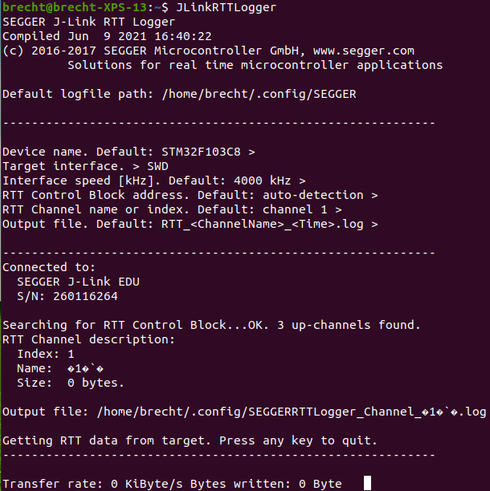
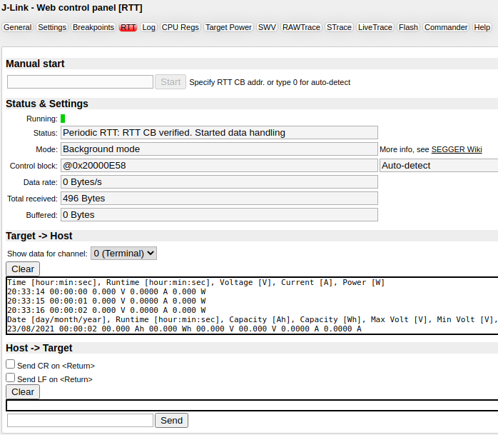

# Segger J-Link debugging tips & tricks

<br/>

- [Segger J-Link debugging tips & tricks](#segger-j-link-debugging-tips--tricks)
  - [1 - J-Link Commander](#1---j-link-commander)
  - [2 - J-Link Web Control Panel](#2---j-link-web-control-panel)
  - [3 - Debugging using UART vs Segger Real-Time Transfer (RTT)](#3---debugging-using-uart-vs-segger-real-time-transfer-rtt)
    - [3.1 - Why use RTT and how does it work](#31---why-use-rtt-and-how-does-it-work)
    - [3.2 - RTT channels (~buffers) and ROM/RAM usage](#32---rtt-channels-buffers-and-romram-usage)
    - [3.3 - Host-side RTT connection](#33---host-side-rtt-connection)
      - [3.3.1 - J-Link RTT Viewer](#331---j-link-rtt-viewer)
      - [3.3.2 - J-Link RTT Client](#332---j-link-rtt-client)
      - [3.3.3 - J-Link RTT Logger](#333---j-link-rtt-logger)
      - [3.3.4 - Telnet connection](#334---telnet-connection)
      - [3.3.5 - J-Link Web Control Panel](#335---j-link-web-control-panel)
    - [3.4 - Target-side RTT implementation](#34---target-side-rtt-implementation)
      - [3.4.1 - Initialization and configuration](#341---initialization-and-configuration)
      - [3.4.2 - Basic character output](#342---basic-character-output)
      - [3.4.3 - Character output to "virtual" terminals in J-Link RTT Viewer](#343---character-output-to-virtual-terminals-in-j-link-rtt-viewer)
      - [3.4.4 - Formatted strings as output](#344---formatted-strings-as-output)
      - [3.4.5 - Colored output](#345---colored-output)
      - [3.5.6 - Character/value reading (input)](#356---charactervalue-reading-input)

<br/>

## 1 - J-Link Commander

`JLink.exe/JLinkExe` is a simple yet powerful command-line utility that can be very useful in the first stages of getting new hardware working and the programming utility of a software development program doesn't give much feedback why programming failed. Below is a list of some very handy commands, more information about J-Link Commander can be found on [this wiki page](https://wiki.segger.com/J-Link_Commander).

<br/>

| Command | Function | Syntax |
|------|-----|-----|
| `?` | Show all available commands | |
| `q` | Quit | |
| `qc` | Close J-Link connection and quit | |
| | | |
| `h` | Halt target chip | |
| `IsHalted` | Check current CPU state (halted/running) | |
| `moe` | Show mode-of-entry, the reason why the CPU is halted | |
| `g` | Run target chip (go) | |
| `s` | Single-step target chip | `s [<NumSteps (dec)>]` |
| `r` | Reset target chip | |
| `RSetType` | Set the current reset type | `RSetType <type>` |
| | | |
| `erase` | Erase internal flash or flash range of selected device | `erase [<SAddr>, <EAddr>]` |
| `mem` | Read memory of target chip | `mem  [<Zone>:]<Addr>, <NumBytes> (hex)` |
| `Regs` | Display contents of registers of halted target chip | |
| `rreg` | Read register of target chip | `rreg <RegName>` |
| `i` | Read JTAG ID of target chip | |
| | | |
| `unlock` | Unlock a device (`nRESET` has to be connected) | `unlock <DeviceName>` |
| `connect` | Establish a target connection | |
| `device` | Select a device to connect to and perform a reconnect | |
| `si` | Select target interface (SWD, JTAG, ICSP, ...) | `si <Interface>` |
| `speed` | Set target interface speed | `speed <freq>/auto/adaptive` |
| | | |
| `st` | Show debugger hardware status | |
| `f` | Show debugger firmware info | |
| `conf` | Show debugger configuration | |
| `power` | Switch power supply for target (J-Link 5V-out) | `power <On/Off> [perm]` |
| `VCOM` | Enable/disable VCOM (Takes effect after power cycle of the J-Link) | `VCOM <enable/disable>` |
| `VTREF` | Set a fixed mV-value for VTref on J-Link | `VTREF <ValuemV>` |

<br/>

## 2 - J-Link Web Control Panel



When a J-Link debugger has an active debug-session, for instance when it's used as a programmer or when `JLinkRTTViewerExe` is running, the **J-Link Web Control Panel** can be accessed on [http://localhost:19080/](http://localhost:19080/). This can be a very useful and intuitive tool where a lot of settings and functions can be easily accessed. The tab **RTT** can for example be used as a simple RTT-viewer.

<br/>

## 3 - Debugging using UART vs Segger Real-Time Transfer (RTT)

The next paragraphs serve as an introduction and summary of RTT functionality. A lot of the following information was taken from the [Segger RTT Wiki page](https://wiki.segger.com/RTT). Be sure to read this if more detailed information is required.

<br/>

### 3.1 - Why use RTT and how does it work

Until recently I debugged with both **breakpoints** and a **UART connection**, the latter I use for real-time code-flow information and displaying variable values. **Using UART has a few disadvantages** though.

First of all you need two extra connections, `TXD` and `RXD`, alongside the regular debugging pins. Using UART also means you loose a MCU peripheral, some RAM and FLASH space and precious clock-cycles. For a recent project I didn't have a single UART peripheral available for debugging purposes, so I couldn't use my self-written low-level UART debugging library [dbprint](https://github.com/Fescron/dbprint).

I wrote [dbprint](https://github.com/Fescron/dbprint) in a way that it didn't need any external libraries, apart from the MCU-specific UART reading/writing functionality. All of the value-translations, like printing `uint32_t` in *decimal* or *hexadecimal* notation, were done with self-written functions. While it is interesting to understand everything that's going on *under-the-hood*, there are some limitations to this. A lot of time was spend creating the functions and the ability to *port* the code to a different MCU was not really kept in mind from the start. Printing `float` values is up until now also not possible.

<br/>

Because of the rather MCU-specific [dbprint](https://github.com/Fescron/dbprint) code and the fact that I did not have a spare UART connection for a recent project, I looked for another way to do **printf debugging**. I first came across **Single Wire Output (SWO)** but since not all ARM-cores support this functionality no real time was spend figuring out how to get this to work. I have a [Segger J-Link debugger](https://www.segger.com/products/debug-probes/j-link/) so I have the ability to use [Segger Real-Time Transfer (RTT)](https://www.segger.com/products/debug-probes/j-link/technology/about-real-time-transfer). This supports all target processors which allows background memory access, so the **Cortex-M** and RX devices. Support for targets without this functionality is also being added (Cortex-A/R and RISC-V), be sure to check the [Segger RTT Wiki page (Modes)](https://wiki.segger.com/RTT#Modes) for more information about this.

With [Segger Real-Time Transfer (RTT)](https://www.segger.com/products/debug-probes/j-link/technology/about-real-time-transfer) it's possible to have a very high-speed bidirectional connection to a target device which can be used to transfer debug information. This can be done **without affecting he MCU's real-time behavior** and **without any additional connections alongside those for programming**. The [RTT implementation code](https://github.com/adfernandes/segger-rtt) writes data to or reads data from special defined memory blocks in the target's memory (*RTT buffers*). These can be found by a [J-Link debugger](https://www.segger.com/products/debug-probes/j-link/) in the target's known RAM regions because the control block contains a special `ID`. The debugger can then read data from and write data to these specific memory blocks to facilitate the bidirectional connection.

<br/>

### 3.2 - RTT channels (~buffers) and ROM/RAM usage

RTT supports **multiple channels in both directions**, up to the host and down to the target. These can be used for different purposes, like having a separate *debug* and *error* channel, sending trace information, ... . The default implementation uses one channel per direction (`up/down-channel 0`), which are meant for printable terminal output and input.

Each channel can be configured to be blocking or non-blocking. In **blocking mode** the application will wait when the buffer is full, until all memory could be written and read back by the host (`SEGGER_RTT_MODE_BLOCK_IF_FIFO_FULL`). This results in a blocked application state but prevents data from getting lost. In **non-blocking mode** only data which fits into the buffer (`SEGGER_RTT_MODE_NO_BLOCK_TRIM`), or none at all (`SEGGER_RTT_MODE_NO_BLOCK_SKIP`, default), will be written and the rest will be discarded. This allows **running in real-time, even when no debugger is connected**.

<br/>

The [RTT implementation code](https://github.com/adfernandes/segger-rtt) uses `~500 Bytes` of **ROM**. `24 Bytes` for the ID and `24 Bytes` per channel are required for the control block in **RAM**. Each channel requires some additional **RAM** for the buffer. The recommended  sizes are `1 kByte` (`1024 Bytes`) for *up channels* (default = `1 kByte`) and `16 - 32 Bytes` for *down channels* (default = `16 Bytes` ). By default maximum 3 up/down channels are available and the buffer for bulk-sending chars via RTT (`SEGGER_RTT_printf()`) is `64 Bytes`. All of the default valued can be overridden in the `SEGGER_RTT_Conf.h` file.

<br/>


### 3.3 - Host-side RTT connection

#### 3.3.1 - J-Link RTT Viewer



`JLinkRTTViewer.exe/JLinkRTTViewerExe` is a GUI application that can be used in two modes:
- **Stand-alone mode**, opening a dedicated connection to J-Link and target.
- **Attach mode**, connecting to an existing J-Link connection of a debugger or **J-Link Commander** and running *parallel* alongside it.
  - Using the argument `-a` or `--autoconnect` when calling `JLinkRTTViewerExe` supresses the settings popup-dialog and directly selects *attach-mode*.

<br/>

In this application **terminal output** of `Up-Channel 0` is displayed. Additionally up to 16 **virtual Terminals** are possible on `Up-Channel 0`. They can be displayed as separate tabs. The target application can switch between *virtual* terminals with `SEGGER_RTT_SetTerminal()` and `SEGGER_RTT_TerminalOut()`.

Sending **text input** is to `Down-Channel 0`. The target application can read this with `SEGGER_RTT_GetKey()` and `SEGGER_RTT_Read()`. It can be configured to directly send each character while typing or to buffer it until *Enter* is pressed (*Input -> Sending...*). In **stand-alone mode** the GUI application can retry to send input, in case the target input buffer is full, until all data could be sent to the target (*Input -> Sending... -> Block if FIFO full*).

<br/>

**Terminal output and text input** on `Channel 0` can be **logged**. The format is the same as used in the *All Terminals* tab. Terminal Logging can be started via *Logging -> Start Terminal Logging...*.

**Data output** on `Channel 1` can also be **logged**, for example if an application sends instrumented event tracing data to this channel. The data log file contains a header and footer and the binary data as received from the application. Data Logging can be started via *Logging -> Start Data Logging...*. **Data Logging is only available in stand-alone mode!**

<br/>

- The **All Terminals** tab
  - Displays the complete output of `Channel 0`.
  - Can display the user input (*Input -> Echo input... -> Echo to "All Terminals"*).
  - Prefixes each output line by the *virtual* Terminal it has been sent to.
  - Shows output on *virtual* Terminal 1 in red, and output on *virtual*  Terminals 2 - 15 in gray.
- The **Terminal 0 - 15** tab
  - Displays the output which has been sent to the specific *virtual* Terminal.
  - Interprets and displays Text Control Codes as sent by the application to show colored text or erase the screen.
- The **Terminal 0** tab
  - Shows by default the output of a RTT application which has not set a Terminal ID.
  - Can display the user input (*Input -> Echo input... -> Echo to "Terminal 0"*).

<br/>

The application can be called with arguments other than `-a` or `--autoconnect`. More information about these can be found on the [Segger RTT Viewer Wiki page (Command line options)](https://wiki.segger.com/J-Link_RTT_Viewer#Command_line_options).

<br/>

#### 3.3.2 - J-Link RTT Client



`JLinkRTTClient.exe/JLinkRTTClientExe` is a command-line application which acts as a Telnet client that automatically tries to reconnect to a J-Link connection when a debug session is closed. Communication is done using `Up/Down-Channel 0`. The application **has to be used in parallel** to a existing J-Link connection (via **J-Link Commander**) or running debug session.

The application supports a few arguments when called. `-LocalEcho <1/0/On/Off>` enables (default) or disables local echo. `-RTTTelnetPort <port>` changes the used port (default = `19021`).

<br/>

#### 3.3.3 - J-Link RTT Logger



`JLinkRTTLogger.exe/JLinkRTTLoggerExe` is a command-line application which opens a dedicated connection to J-Link and can be used **stand-alone**, without a running debug session. Data from all RTT Up-Channels can be read and logged to a file (default = `Up-Channel 1`).

The application supports a few arguments when called to, for example, directly set the target device or RTT channel. More information about this can be found on the [Segger RTT Wiki page (RTT Logger)](https://wiki.segger.com/RTT#RTT_Logger).

<br/>
<br/>
<br/>
<br/>

#### 3.3.4 - Telnet connection

If a connection to a J-Link is active, for example in the case of an ongoing *debug session* of a target device, a **Telnet client** can be used to (by default) communicate on `Up/Down-Channel 0`. The address the client has to connect to is `localhost:19021`.

The connection will be closed when the connection to the target is closed, for example in the case where a debug session is halted. Use the **J-Link RTT Client** to automatically reconnect if a debug session is restarted afterwards.

It's also possible to change the channel, set the *RTT Control Block address* and the *RTT Control Block search range* with so called *Segger Telnet Config Strings*. These strings have to be send within `100 ms` after opening the telnet connection. As an example, the string `$$SEGGER_TELNET_ConfigStr=RTTCh;1$$` sets the channel to `Up/Down-Channel 1`. More information about these strings can be found on the [Segger RTT Wiki page (Segger Telnet Config String)](https://wiki.segger.com/RTT#SEGGER_TELNET_Config_String).

<br/>

#### 3.3.5 - J-Link Web Control Panel



As previously mentioned, the **J-Link Web Control Panel** can be accessed on [http://localhost:19080/](http://localhost:19080/) when a J-Link debugger has an active debug-session. The **RTT-tab** can here be used as a simple yet intuitive RTT-viewer.

A RTT-session can be manually started, and the RTT control block can be both manually entered or auto-detected. It's possible to see the data on *channel 0 (terminal), 1 and 2* and data can also be send from the host to the target device.

<br/>
<br/>
<br/>

### 3.4 - Target-side RTT implementation

| Quick access links |
|------|
| [Target-side RTT implementation code (unofficial repository)](https://github.com/adfernandes/segger-rtt) |
| [Segger RTT Wiki page (Implementation)](https://wiki.segger.com/RTT#Implementation) |

<br/>

The SEGGER RTT implementation is written in *ANSI C* and can be integrated into any embedded application using the code, available for download using the above links. It can be used via a simple and easy to use API (see the following chapters for examples) and it is even possible to override the standard `printf()` functions to use RTT so less overhead is used. A method to write formatted strings is also available (`SEGGER_RTT_Printf()`), which is smaller than most standard library `printf` implementations and does not require heap and only a configurable amount of stack.

The SEGGER RTT implementation is fully configurable with pre-processor defines. Reading and writing can be made task-safe with `Lock()` and `Unlock()` routines, the number of buffers, as well as the size of the terminal buffers can be set up easily. Most of this is done in the configuration-file `SEGGER_RTT_Conf.h`

<br/>

**The following chapters list examples for most of the available functions. Not all of them are covered, for all available functions please check** `SEGGER_RTT.c`

<br/>

***IMPORTANT:*** Be sure to always include the Segger RTT header-file when using RTT functionality in source-files:

```C
/* Include Segger RTT functionality (includes SEGGER_RTT_Conf.h as well) */
#include "SEGGER_RTT.h"
```

<br/>

#### 3.4.1 - Initialization and configuration

Because of the way the implementation is written, **generally no initialization and configuration is needed**. Most of the time one can start using RTT printing methods without calling additional configuration methods. In some cases it is however useful to initialize RTT manually or change some of the underlying functionality, so examples for some of the available methods are described in the following paragraphs.

```C
/** Automatically initialize RTT and also to clear the screen and reposition 
  * the cursor to the top-left */
SEGGER_RTT_WriteString(0, RTT_CTRL_CLEAR);

/** Initialize RTT Control Block structure
  *  - This is generally used when using RAM only targets and should then be called 
  *    at the start of the application
  *  - In most other cases this is automatically called by the RTT methods */
SEGGER_RTT_Init();
```

<br/>

*Output/up buffer 0* is configured during compile-time. The following method-calls can change the behavior if the buffer is full. These are the so-called **buffer flags**.

***NOTE:*** `int`, returned by the RTT functions and assumed to be 32-bits in size, is not explicitly casted to `int8_t` but the returned values should fit according to the underlying code.

```C
/** Configure output/up buffer 0 (first parameter) in non-blocking-skip mode
  *  - Application does not wait, all data is lost if the fifo-buffer is full
  *  - This is the default mode
  *  - Returns "0" if the configuration was successful or "-1" if an error occurred */
int8_t result = SEGGER_RTT_SetFlagsUpBuffer(0, SEGGER_RTT_MODE_NO_BLOCK_SKIP);

/** Configure output/up buffer 0 (first parameter) in non-blocking-trim mode
  *  - Application does not wait, data that can't fit is lost if the fifo-buffer is full
  *  - Returns "0" if the configuration was successful or "-1" if an error occurred */
int8_t result = SEGGER_RTT_SetFlagsUpBuffer(0, SEGGER_RTT_MODE_NO_BLOCK_TRIM);

/** Configure output/up buffer 0 (first parameter) in blocking mode
  *  - Application waits if necessary, no data is lost
  *  - Returns "0" if the configuration was successful or "-1" if an error occurred */
int8_t result = SEGGER_RTT_SetFlagsUpBuffer(0, SEGGER_RTT_MODE_BLOCK_IF_FIFO_FULL);
```

<br/>

***NOTE:*** The RAM regions or the specific address of the Control Block can also be set via the **host** applications to speed up detection or if the block cannot be found automatically.

<br/>

#### 3.4.2 - Basic character output

Below are a few examples on how to facilitate basic character output.

***NOTE:*** `int`, returned by the RTT functions and assumed to be 32-bits in size, is not explicitly casted to `uint8_t` but the returned values should fit according to the underlying code.

```C
/** Clear the screen and reposition the cursor to the top-left (RTT_CTRL_CLEAR), 
  * print a zero-terminated (\0) string/character array to output/up-buffer 0 
  * (first parameter), return the carriage and go to the next line (/r/n)
  *  - Internally calls "SEGGER_RTT_Write" after the length of the string is calculated
  *  - Returns the number of bytes stored in the up-buffer
  *  - Data is stored according to buffer flags */
uint32_t bytes = SEGGER_RTT_WriteString(0, RTT_CTRL_CLEAR"Text goes here\r\n");

/** Same as above but now using a character array */
char    text[] = "Text goes here\r\n";
uint32_t bytes = SEGGER_RTT_WriteString(0, text);

/** Print a specified number of bytes to output/up-buffer 0 (first parameter)
  *  - A pointer to a character array (second parameter) and its size in bytes 
  *   (third parameter) need to be given
  *  - Returns the number of bytes stored in the up-buffer 
  *  - Internally calls "SEGGER_RTT_WriteNoLock"
  *  - Data is stored according to buffer flags */
char character = 'A';
uint32_t bytes = SEGGER_RTT_Write(0, &character, 1);

/** Same as above but does not lock the application so interrupts can be handled
  *  - Does not call initialization functionality and may only be called after 
  *    RTT has been initialized, either by calling SEGGER_RTT_Init() or calling 
  *    another RTT API function first 
  *  - Data is stored according to buffer flags */
char character = 'A';
uint32_t bytes = SEGGER_RTT_WriteNoLock(0, &character, 1);

/** Print a single character to output/up-buffer 0 (first parameter)
  *  - Returns the number of bytes stored in the up-buffer
  *  - Data is stored according to buffer flags */
uint8_t bytes = SEGGER_RTT_PutChar(0, 'a');
```

<br>

#### 3.4.3 - Character output to "virtual" terminals in J-Link RTT Viewer

When using **J-Link RTT Viewer** to capture the RTT messages, some methods are available to change the *(virtual) Terminal* to which data is send. This is internally done with specific sequences that are interpreted by the J-Link RTT Viewer. Other applications like a Telnet Client will ignore them.

***NOTE:*** `int`, returned by the RTT functions and assumed to be 32-bits in size, is not explicitly casted to `int8_t` but the returned values should fit according to the underlying code.

```C
/** Change the "virtual" terminal on channel 0 to show all following "Write",
  * "WriteString" or "printf" outputs to "1" ("0" - "F" are all correct options) 
  *  - Returns "0" if the configuration was successful or "-1" if an error occurred */
int8_t result = SEGGER_RTT_SetTerminal(1);

/** Print a zero-terminated (\0) string/character array to a specific "virtual" terminal,
  * in this case "1", on output/up-buffer 0, return the carriage and 
  * go to the next line (/r/n)
  *  - If the returned value is >= 0 then it equals the amount of bytes stored 
  *    in the up-buffer
  *  - Returns "-1" if an error occurred */
int32_t result = SEGGER_RTT_TerminalOut(1, "Text goes here\r\n");
```

<br/>

#### 3.4.4 - Formatted strings as output

Below are some basic examples to print formatted strings as output.

```C
/** Print an unsigned integer value (%u) and signed integer value (%d) to 
  * output/up-buffer 0 (first parameter), return the carriage
  * and go to the next line (/r/n)
  *  - Internally calls "SEGGER_RTT_vprintf" and eventually "SEGGER_RTT_Write"
  *  - If result >= 0 then it equals the amount of bytes stored in the up-buffer
  *  - If result < 0 then an error occurred
  *  - Data is stored according to buffer flags */
uint32_t uValue = 42;
int32_t  sValue = -42;
int32_t  result = SEGGER_RTT_printf(0, "uValue = %u, sValue = %d\r\n", uValue, sValue);

/** Print a hexadecimal integer value (%x) to output/up-buffer 0 (first parameter),
  * return the carriage and go to the next line (/r/n)
  *  - This does not print the leading "0x"
  *  - Internally calls "SEGGER_RTT_vprintf" and eventually "SEGGER_RTT_Write"
  *  - If result >= 0 then it equals the amount of bytes stored in the up-buffer
  *  - If result < 0 then an error occurred
  *  - Data is stored according to buffer flags */
uint32_t value = 0xFF;
int32_t result = SEGGER_RTT_printf(0, "Value = %x\r\n", value);

/** Print a hexadecimal integer value with 8-digits (%p) to output/up-buffer 0 
  * (first parameter), return the carriage and go to the next line (/r/n)
  *  - This does not print the leading "0x"
  *  - Internally calls "SEGGER_RTT_vprintf" and eventually "SEGGER_RTT_Write"
  *  - If result >= 0 then it equals the amount of bytes stored in the up-buffer
  *  - If result < 0 then an error occurred
  *  - Data is stored according to buffer flags */
uint32_t value = 0x000000FF;
int32_t result = SEGGER_RTT_printf(0, "Value = %p\r\n", value);

/** Print a character (%c) to output/up-buffer 0 (first parameter),
  * return the carriage and go to the next line (/r/n)
  *  - Internally calls "SEGGER_RTT_vprintf" and eventually "SEGGER_RTT_Write"
  *  - If result >= 0 then it equals the amount of bytes stored in the up-buffer
  *  - If result < 0 then an error occurred
  *  - Data is stored according to buffer flags */
char character = 'a';
int32_t result = SEGGER_RTT_printf(0, "Character = %c\r\n", character);

/** Print a string (%s) to output/up-buffer 0 (first parameter),
  * return the carriage and go to the next line (/r/n)
  *  - Internally calls "SEGGER_RTT_vprintf" and eventually "SEGGER_RTT_Write"
  *  - If result >= 0 then it equals the amount of bytes stored in the up-buffer
  *  - If result < 0 then an error occurred
  *  - Data is stored according to buffer flags */
char    text[] = "Text goes here";
int32_t result = SEGGER_RTT_printf(0, "Text = %s\r\n", text);
```

<br/>

Below there are some more advanced examples to print formatted strings as output.

```C
/** Print a signed integer value (%d) to output/up-buffer 0 (first parameter) 
  * and always print the sign-extension (+), return the carriage and go
  * to the next line (/r/n)
  *  - Internally calls "SEGGER_RTT_vprintf" and eventually "SEGGER_RTT_Write"
  *  - If result >= 0 then it equals the amount of bytes stored in the up-buffer
  *  - If result < 0 then an error occurred
  *  - Data is stored according to buffer flags */
int32_t value  = 42;
int32_t result = SEGGER_RTT_printf(0, "Value = %+d\r\n", value);

/** Print an unsigned integer value (%u) to output/up-buffer 0 (first parameter)
  * and make sure the value-field always has a width of 4 characters (4),
  * return the carriage and go to the next line (/r/n)
  *  - Internally calls "SEGGER_RTT_vprintf" and eventually "SEGGER_RTT_Write"
  *  - If result >= 0 then it equals the amount of bytes stored in the up-buffer
  *  - If result < 0 then an error occurred
  *  - Data is stored according to buffer flags */
uint32_t value = 42;
int32_t result = SEGGER_RTT_printf(0, "Value = %4u\r\n", value);

/** Print an unsigned integer value (%u) to output/up-buffer 0 (first parameter),
  * make sure the value-field always has a width of 4 characters (4),
  * use zeros instead of spaces for padding (0), return the carriage 
  * and go to the next line (/r/n)
  *  - Internally calls "SEGGER_RTT_vprintf" and eventually "SEGGER_RTT_Write"
  *  - If result >= 0 then it equals the amount of bytes stored in the up-buffer
  *  - If result < 0 then an error occurred
  *  - Data is stored according to buffer flags */
uint32_t value = 42;
int32_t result = SEGGER_RTT_printf(0, "Value = %04u\r\n", value);

/** Print an unsigned integer value (%u) to output/up-buffer 0 (first parameter),
  * make sure the value-field always has a width of 4 characters (.4)
  * (add leading zeros if necessary), return the carriage
  * and go to the next line (/r/n)
  *  - Internally calls "SEGGER_RTT_vprintf" and eventually "SEGGER_RTT_Write"
  *  - If result >= 0 then it equals the amount of bytes stored in the up-buffer
  *  - If result < 0 then an error occurred
  *  - The flag "0" (pad with zeros instead of spaces) is ignored when used
  *    in combination with "precision" (._)
  *  - Data is stored according to buffer flags */
uint32_t value = 42;
int32_t result = SEGGER_RTT_printf(0, "Value = %.4u\r\n", value);

/** Print an unsigned integer value (%u) to output/up-buffer 0 (first parameter),
  * make sure the value-field always has a width of 4 characters (4),
  * left-justify within the field width (-), return the carriage
  * and go to the next line (/r/n)
  *  - Internally calls "SEGGER_RTT_vprintf" and eventually "SEGGER_RTT_Write"
  *  - If result >= 0 then it equals the amount of bytes stored in the up-buffer
  *  - If result < 0 then an error occurred
  *  - The flag "0" (pad with zeros instead of spaces) is ignored when used
  *    in combination with the flag "-"
  *  - Data is stored according to buffer flags */
uint32_t value = 42;
int32_t result = SEGGER_RTT_printf(0, "Value = %-4u\r\n", value);
```

<br/>

#### 3.4.5 - Colored output

Text and/or values can be given a specific color with the following *color control sequences*:

- `RTT_CTRL_RESET` Reset the text- and background color.
- `RTT_CTRL_TEXT_xxx` Set the **text** color to one of the following colors.
  - `BLACK`, `RED`, `GREEN`, `YELLOW`, `BLUE`, `MAGENTA`, `CYAN`, `WHITE` (light grey)
  - `BRIGHT_BLACK` (dark grey), `BRIGHT_RED`, `BRIGHT_GREEN`, `BRIGHT_YELLOW`, `BRIGHT_BLUE`, `BRIGHT_MAGENTA`, `BRIGHT_CYAN`, `BRIGHT_WHITE`
- `RTT_CTRL_BG_xxx` Set the **background** color to one of the previous colors.

<br/>

Below are two examples with colored text using the methods `SEGGER_RTT_WriteString` and `SEGGER_RTT_printf`, both of which use the *color control sequences* a bit different.

```C
/** Print some colored text to output/up-buffer 0 (first parameter)
  * and go to the next line (/r/n)
  *  - Internally calls "SEGGER_RTT_Write" and eventually "SEGGER_RTT_WriteNoLock"
  *  - Returns the number of bytes stored in the up-buffer
  *  - Data is stored according to buffer flags */
uint32_t result = SEGGER_RTT_WriteString(0,
        RTT_CTRL_RESET"Red: " \
        RTT_CTRL_TEXT_BRIGHT_RED"This text is red. " \
        RTT_CTRL_TEXT_BLACK"" \
        RTT_CTRL_BG_BRIGHT_RED"This background is red. " \
        RTT_CTRL_RESET"Normal text again.\r\n"
    );

/** Same as above but with another method
  *  - Internally calls "SEGGER_RTT_vprintf" and eventually "SEGGER_RTT_Write"
  *  - If result >= 0 then it equals the amount of bytes stored in the up-buffer
  *  - If result < 0 then an error occurred
  *  - Data is stored according to buffer flags */
int32_t result = SEGGER_RTT_printf(0, 
        "%sRed: %sThis text is red. %s%sThis background is red. %sNormal text again.\r\n",
        RTT_CTRL_RESET,
        RTT_CTRL_TEXT_BRIGHT_RED,
        RTT_CTRL_TEXT_BLACK,
        RTT_CTRL_BG_BRIGHT_RED,
        RTT_CTRL_RESET
    );
```

<br/>

#### 3.5.6 - Character/value reading (input)

***NOTE:*** `int`, returned by the RTT functions and assumed to be 32-bits in size, is not explicitly casted to `uint8_t`/`int16_t` but the returned values should fit according to the underlying code.

```C
/** Wait for (at least one) character, previously stored by the host, to be available 
  * in input/down-buffer 0 and return it ("0" - "255")
  *  - Internally calls "SEGGER_RTT_GetKey" until a character is received */
uint8_t character = SEGGER_RTT_WaitKey();

/** Read one character, previously stored by the host, from input/down-buffer 0
  * and return it ("0" - "255")
  *  - Returns "-1" if no character is available (buffer empty) (uint8_t => uint16_t)
  *  - Internally calls "SEGGER_RTT_READ" */
int16_t character = SEGGER_RTT_GetKey();

/** Check if at least one character, previously stored by the host, 
  * is available in input/down-buffer 0
  *  - Returns "0" if no characters are available 
  *  - Returns "1" if at least one character is available */
uint8_t result = SEGGER_RTT_HasKey();

/** Reads characters, previously stored by the host, from input/down buffer 0 
  * (first parameter)
  *  - A pointer to a buffer to store the characters (second parameter) and its size 
  *    in bytes (third parameter) (1 char = 1 byte) need to be given
  *  - Returns the number of bytes that have been read
  *  - Internally calls "SEGGER_RTT_ReadNoLock" */
uint32_t characters = "";
uint32_t bytes = SEGGER_RTT_Read(0, &characters, 4);

/* Same as above but does not lock the application so interrupts can be handled */
uint32_t characters = "";
uint32_t bytes = SEGGER_RTT_ReadNoLock(0, &characters, 4);

/** Check if there is data, previously stored by the host, 
  * available in input/down-buffer 0 (first parameter)
  *  - Returns "0" if no data is available in the buffer */
int8_t result = SEGGER_RTT_HasData(0);
```
