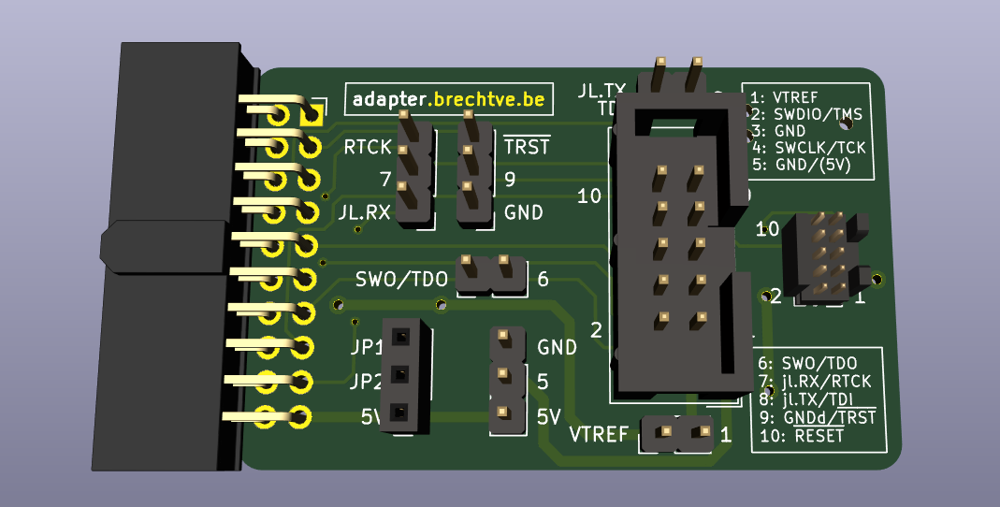
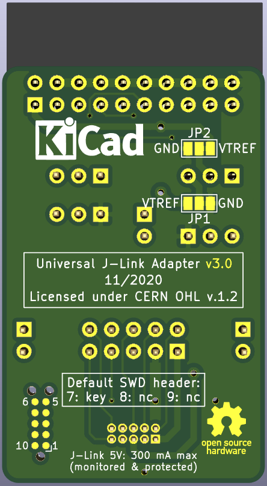
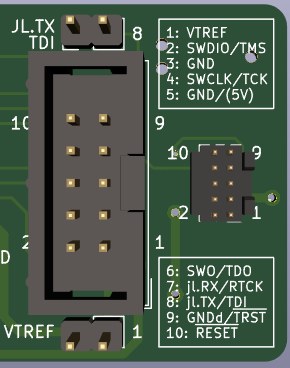
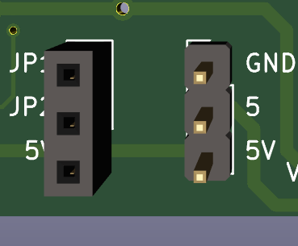
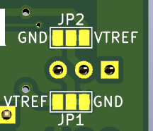
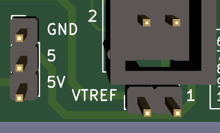
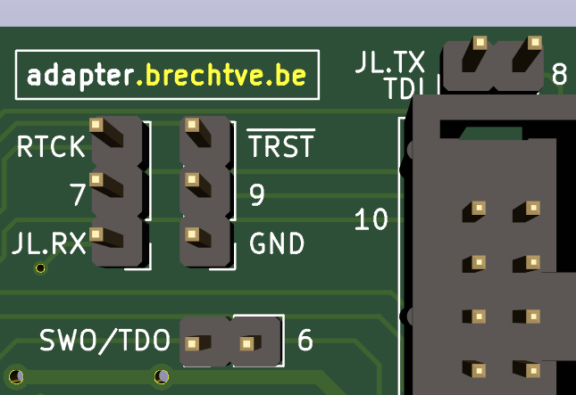

# Universal J-Link Adapter


<br/>



<br/>
<br/>

| Quick access links |
|------|
| [Adapter **schematic** (PDF)](hardware/jlink-tagConnect-adapter-v3/jlink-tagConnect-adapter-v3.pdf) |
| [Buy this adapter-PCB on **OSHPark**]() (`TODO`) |
| [Basic **J-Link Commander** usage and using **Segger Real-Time Transfer (RTT)** instead of UART](JLinkExe-SeggerRTT-debugging-TipsTricks.md) (`TODO`) |

<br/>



This multifunctional adapter board, primarily designed for use with a [J-Link debugger](https://www.segger.com/products/debug-probes/j-link/models/j-link-base/) (but others which follow the standard 20-pin JTAG/SWD pinout also work), allows the user to have the standard [9 pin Cortex-M SWD/JTAG pinout](https://www.segger.com/products/debug-probes/j-link/accessories/adapters/9-pin-cortex-m-adapter/) on both a 0.1" (2.54mm) and 0.05" (1.27mm) male pinheader. With additional jumpers it's possible to have **extra functionality** like **UART debugging though the J-Link's VCOM** on pins that normally aren't used in some modes, if the probe's hardware supports this. Good **labeling of all pin numbers and their corresponding functionality** also help to speed-up the embedded-development process. Additional information about the pinout of *default* SWD-headers and the voltage output of the J-Link debugger is also available on the back of the board, along with the pin-numbers of the [10 pin Tag-Connect header](http://www.tag-connect.com/TC2050-IDC).

Furthermore, the adapter-PCB can **power the target board** through the `VTREF` connection. For this to work a **DC-DC converter or LDO regulator** can be plugged into the female 3-pin socket on the adapter board to allow the J-Link's 5V-Supply to be converted to, for example 3.3V. Multiple 3-pin voltage conversion boards are supported because solder-jumpers on the back of this adapter allow the `VOUT`and `GND`pins to be swapped around. The 5V voltage can also be supplied *as-is* on a header pin by swapping a jumper around.


The **0.05" (2.54mm) header** is recommended for when the target board is mostly connected to the debugger and the board in question also has a header of this size. The **0.1" (1.27mm) IDC header** is recommended for use with regular *Dupont-wires* or a [10 pin Tag-Connect adapter cable](http://www.tag-connect.com/TC2050-IDC). The latter allows target boards to be quickly reprogrammed *on-location*.

The picture on the left depicts the `TagConnect 2050` cable on the top-right, next to its corresponding PCB footprint. Below this is a 0.05" header with its corresponding cable.

<br/>

## 0 - Table of Contents



- [Universal J-Link Adapter](#universal-j-link-adapter)
  - [0 - Table of Contents](#0---table-of-contents)
  - [1 - Adapter functionality](#1---adapter-functionality)
    - [1.1 - Supply power to the target board (5V and/or other voltages)](#11---supply-power-to-the-target-board-5v-andor-other-voltages)
    - [1.2 - Additional functionality on "unused" pins using jumpers](#12---additional-functionality-on-unused-pins-using-jumpers)
  - [2 - KiCad debug header symbols](#2---kicad-debug-header-symbols)
  - [3 - Layout guidelines for target boards](#3---layout-guidelines-for-target-boards)
  - [4 - BOM](#4---bom)

<br/>

## 1 - Adapter functionality

Aside from the ability to easily make connections to target boards using the well-labeled pinout and corresponding functionality of both output-headers, the following paragraphs will give more information about additional functions this adapter can enable.

### 1.1 - Supply power to the target board (5V and/or other voltages)



As previously stated, a **DC-DC converter or LDO regulator** can be plugged into the 3-pin female header on this adapter with the labels `JP1 JP2 5V`. This would allow the adapter to supply power through the `VTREF`-line (`PIN 1`) to the target board with the correct voltage, derived from the **5V supply of the J-Link programmer**. The 5V voltage can **also be made available *as-is* on** `PIN 5` of the output headers by putting a jumper in the correct position of the header labeled `GND 5 5V`. With the same jumper, `GND` can also be made available on `PIN 5`. Both the voltage-converter socket and the `PIN 5`-jumper are depicted on the picture on the left.

If the user wishes to **not power the target board using** `VTREF`, for example in the case that the target board is already getting its own power from a battery, the **voltage converter should simply not be plugged in**. The J-Link debugger will then still get the correct I/O voltage as a logic-level reference if the MCU-supply-voltage is present on `VTREF` (`PIN 1`).



If the **pinout of the 3-pin voltage converter doesn't match** `VIN - VOUT - GND`, the last two pins can be changed around by swapping the solder joints on `JP1` and `JP2` on the bottom of the PCB. This is also also depicted on the picture on the left. If the present lines are cut on both jumpers and new solder connections are made on the other side then the pinout `VIN - GND - VOUT` will be selected.

<br/>

The **5V output needs to be enabled on the J-Link** using the [J-Link Commander](https://wiki.segger.com/J-Link_Commander) software (`JLink.exe/JLinkExe`). The following command needs to be called for the 5V supply to be always enabled:

```shell
power on perm
```

<br/>



If the target-board is powered by a voltage-converter on the adapter, a jumper labeled `VTREF 1` below the 0.1" header allows a **current meter** to be plugged in-line between the converter and the target board so the power usage can be monitored. If 5V is passed to the target-board through `PIN 5`, a jumper in this location can also be substituted for a current meter. Both headers are depicted on the picture on the right.

<br/>

### 1.2 - Additional functionality on "unused" pins using jumpers

In addition to the *default* SWD/JTAG-pinouts it's also possible to add extra functionality to normally *unused* pins of the 02x05 headers. On the adapter-board are a few jumpers located to select these functions.



- **PIN 5** is normally connected to GND.
  - On the [J-Link 10 pin Needle Adapter](https://www.segger.com/products/debug-probes/j-link/accessories/adapters/10-pin-needle-adapter/) this pin outputs the J-Link's `5V-Supply`. A jumper can be used to select this, which was already mentioned in the previous paragraph.
- **PIN 6** is normally used for a `SWO` or `TDO` connection. A jumper labeled `SWO/TDO 6` can however be used to disconnect the debugger, so the pin coming from the MCU can be used as an additional debug signal (e.g. high when in some code, low when not). Simply remove the jumper and add a *Dupont*-cable on the pin labeled `6`.
- **PIN 7** is on the [standard 9-pin Cortex-M SWD/JTAG pinout](https://www.segger.com/products/debug-probes/j-link/accessories/adapters/9-pin-cortex-m-adapter/) *not populated* since this is the **key**.
  - **SWD mode:** A jumper labeled `RTCK 7 JL.RX`, which can be seen on the picture on the right, can be used to connect this pin to the J-Link's VCOM `RX` pin. This way UART debugging functionality can be used in conjunction with SWD.
  - *NOTE:* It's possibel that VCOM needs to be enabled on the probe. This can be done using [J-Link Commander](https://wiki.segger.com/J-Link_Commander) (`JLinkExe/JLink.exe`) by typing the command `vcom enable`. VCOM will start working on the next power-cycle.
  - **JTAG mode:** The same jumper can also be used to connect this pin to `RTCK` if necessary.
- **PIN 8**
  - **SWD mode:** Normally this pin is *not connected*, but a jumper labeled `JL.TX TDI 8` allows it to be connected to the J-Link's **VCOM** `TX` pin.
  - **JTAG mode:** On J-Link's [9 pin](https://www.segger.com/products/debug-probes/j-link/accessories/adapters/9-pin-cortex-m-adapter/) and [19 pin](https://www.segger.com/products/debug-probes/j-link/accessories/adapters/19-pin-cortex-m-adapter/) Cortex-M adapters `PIN 9` is connected to `TDI`.
  - *NOTE:* `TX` and `TDI` are in both modes located on the same physical pin. This means that normally this pin shouldn't be disconnected but a jumper allows this just in case.
- **PIN 9**
  - **SWD mode:** Normally this pin is *not connected*, but sometimes a target board uses this pin as `GNDdetect` so it can detect the presence of a debugger. With a jumper labeled `nTRST 9 GND` this pin can be connected to GND to enable this functionality.
  - *NOTE:* When `PIN 9` is connected to a microcontroller pin that can act as an output, the adapter can be used to *break-out* this pin to another instrument for, for example, code-timing analysis. Simply remove the jumper and add a *Dupont*-cable on the pin labeled `9`.
  - **JTAG mode:** On J-Link's [9 pin](https://www.segger.com/products/debug-probes/j-link/accessories/adapters/9-pin-cortex-m-adapter/) and [19 pin](https://www.segger.com/products/debug-probes/j-link/accessories/adapters/19-pin-cortex-m-adapter/) Cortex-M adapters this pin can be connected to `nTRST` using a solder jumper. On this adapter board this can be done using a regular jumper.

<br/>

## 2 - KiCad debug header symbols

On the repository [brechtve-kicad-things](https://github.com/Fescron/brechtve-kicad-things) (kicad.brechtve.be) symbols are available where these additional functions, selectable using the jumpers, are depicted for both SWD and JTAG modes. The "regular" pinouts are put into brackets. The symbols can be found in the library `BrechtVE_DebugHeader.lib`.

The symbols to be linked to a **0.05" (1.27mm) header** on the target board are the following:

<div style="text-align: center">

</div>

<br/>

Symbols are also supplied to be linked to a **TagConnect 2050 footprint**. The pin numbers and corresponding functions are mostly the same as the previously mentioned SWD/JTAG connectors, but the direction in wich the pins are layed out on the PCB are different. This is reflected in other symbols:

<div style="text-align: center">

</div>

<br/>

For reference these symbols, along with additional information regarding jumpers and layout guidelines, can be found on the [adapter schematic](hardware/jlink-tagConnect-adapter-v3/jlink-tagConnect-adapter-v3.pdf). A lot more information regarding KiCad itself is also available on the repository [brechtve-kicad-things](https://github.com/Fescron/brechtve-kicad-things).

<br/>

## 3 - Layout guidelines for target boards

It's advised to add the following passives on the *target board* for protection and stability. This is also mentioned in the [adapter schematic](hardware/jlink-tagConnect-adapter-v3/jlink-tagConnect-adapter-v3.pdf).
- 100 kΩ pullup on `SWDIO`.
- 10 kΩ pullup on `RXD`.
- 100 Ω inline current limiting resistors on `TXD` and`RXD` lines.
  - This is mostly important for when `UART` is available on additional external headers, and is less important if this is made available on the SWD-header.

<br/>

## 4 - BOM

| Component   | Footprint                                                | Manufacturer `Type`                             | Ordering                                                                                                                                                 |
| ------------- | -------------------------------------------------------- | -------------------------------- | -------------------------------------------------------------------------------------------------------------------------------------------------------- |
| J1            | 02x10 0.1" (2.54mm) Right Angle Female IDC socket                 | Sullins `SFH11-PBPC-D10-RA-BK`   | [digikey.be](https://www.digikey.be/product-detail/en/sullins-connector-solutions/SFH11-PBPC-D10-RA-BK/S9205-ND/1990098)                                 |
| J1 (alt.)               | 02x10 0.1" Right Angle Female socket                     | Samtec `SSW-110-02-L-D-RA`       | [mouser.be](https://www.mouser.be/ProductDetail/Samtec/SSW-110-02-L-D-RA?qs=sGAEpiMZZMvffgRu4KC1RxM6nKwEP14AKIDk%2F38Cqz31wxmPLBdGrA%3D%3D)              |
| J2            | 02x05 0.1" Male IDC header                               | Samtec `TST-105-01-L-D`          | [mouser.be](https://www.mouser.be/ProductDetail/Samtec/TST-105-01-L-D?qs=sGAEpiMZZMvlX3nhDDO4AI%252BRmCAOnNK%252B8W%2Fig2WTmT0%3D)                       |
| J3              | 02x05 0.05" (1.27mm) Male Key-Shrouded header        | Samtec `FTSH-105-01-L-D-K`       | [mouser.be](https://www.mouser.be/ProductDetail/Samtec/FTSH-105-01-L-D-K?qs=%2Fha2pyFaduhoAtv%2FWE6syK%2F3gejFMKjm9lp5582mCss1896wuL7UnQ%3D%3D)          |
|               | TagConnect 10 pin IDC to needles without legs            | TagConnect `TC-2050-IDC-NL`                 | [digikey.be](https://www.digikey.be/product-detail/nl/tag-connect-llc/TC2050-IDC-NL/TC2050-IDC-NL-ND/2605367)                                            |
|               | 2x05 0.05" IDC cable, 6 inch (15 cm) long | Samtec `FFSD-05-D-06.00-01-N` | [mouser.be](https://www.mouser.be/ProductDetail/Samtec/FFSD-05-D-0600-01-N?qs=IAPfasySNH%2Fh8ArRPOeNJA%3D%3D) |

<br/>

**Samtec connectors:**

- `L`: 10 µ" (0.25 µm) Gold on post/contact, Matte Tin on tail.
- `F`: Gold flash on post/contact, Matte Tin on tail.
