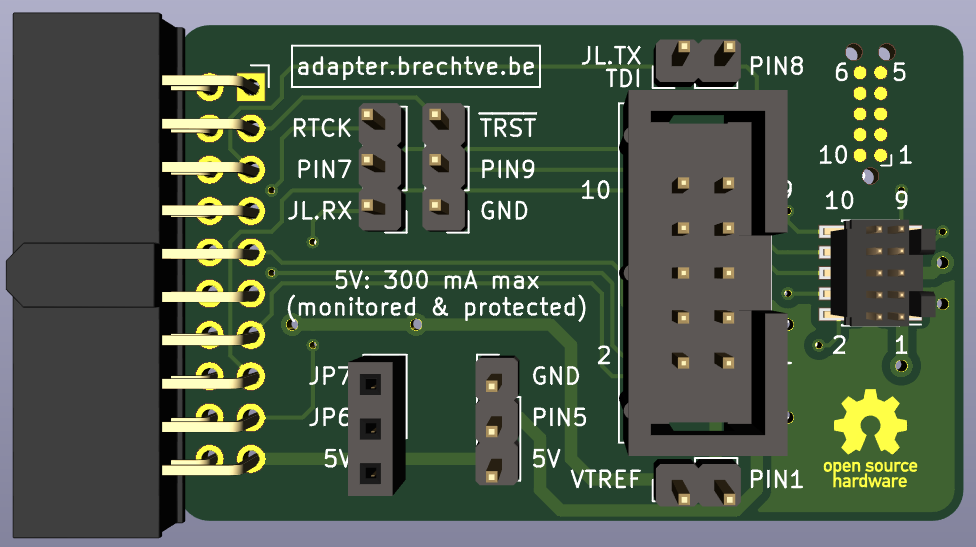
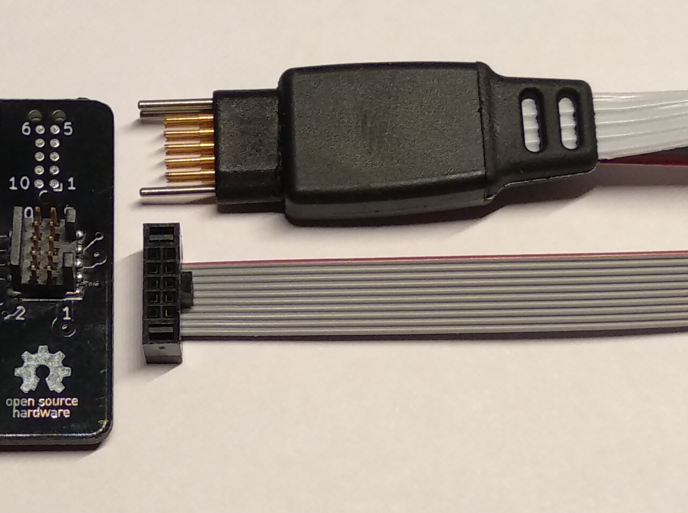
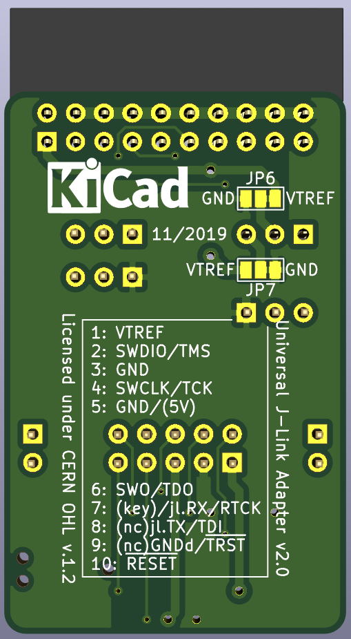
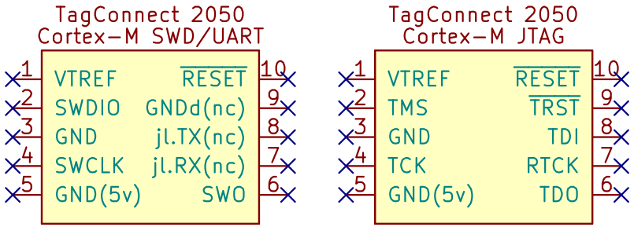

# Universal J-Link Adapter


<br/>

 

<br/>

- [Quick link to the schematic](hardware/jlink-tagConnect-adapter-v2/jlink-tagConnect-adapter-v2.pdf)

<br/>

This multifunctional adapter board, primarily designed for use with a [J-Link debugger](https://www.segger.com/products/debug-probes/j-link/models/j-link-base/) (or others which follow its standard 20-pin JTAG/SWD pinout), allows the user to have the standard [9 pin Cortex-M SWD/JTAG pinout](https://www.segger.com/products/debug-probes/j-link/accessories/adapters/9-pin-cortex-m-adapter/) on both a 0.1" (2.54mm) and 0.05" (1.27mm) header. With additional jumpers, it's possible to have **extra options (for example UART debugging though the J-Link's VCOM) on pins that normally aren't used in some modes**. The adapter can also **power the target board** through `VTREF`. A DC-DC converter can be plugged in on the adapter to allow the J-Link's `5V-Supply` to be converted to, for example 3.3V.

The **0.05" header** is recommended for development when the target board is mostly connected to the debugger. The **0.1" IDC header** is recommended for use with a [10 pin Tag-Connect adapter cable](http://www.tag-connect.com/TC2050-IDC), so target boards can quickly be reprogrammed *on-location*.



On the picture next to this text on top you can see this TagConnect 2050 cable next to its corresponding PCB footprint. Below you can see the 0.05" header with its corresponding cable.

<br/>

A lot of useful information is also printed on the *silkscreen* of the PCB. Noteworthy is the **pinout numbering** of the 0.1" and 0.05" headers (wich are connected to SWD/JTAG pins) and also the numbering of the 10-pin Tag-Connect header on the front. The **functions for every pin** are also printed on the back of the PCB.


<br/>

## 1 - Functions

### 1.1 - Supply power to a target board

A **DC-DC converter** can be plugged in on the header with the labels `5V JP6 JP7` to supply the target board with the correct voltage, derived from the 5V supply of the J-Link programmer. If the pinout of the converter doesn't match `VIN - VOUT - GND`, the last two pins can be changed around by swapping the solder joints on `JP6` and `JP7` on the bottom of the PCB. Then the pinout `VIN - GND - VOUT` will be selected.

This 5V output needs to be enabled on the J-Link using the `J-Link Commander` (`JLinkExe`) software. The following command needs to be called for the 5V supply to be always enabled:

```shell
power on perm
```

If the user wishes to **not power the target board using `VTREF`** (for example in the case that the target board is already getting its own power from a battery), the **DC-DC converter should simply not be plugged in**.

<br/>

**PIN 1** (`VTREF`) normally supplies the J-Link adapter with a voltage to allow it to generate the correct logic levels. With this adapter board the target board can be powered through `VTREF` using the previously mentioned DC-DC converter. A jumper is supplied below the 0.1" header to allow a **current meter** to be plugged in-line between the DC-DC converter and the target board so the power usage can be monitored.

<br/>

### 1.2 - Additional functionality on unused pins using jumpers



- **PIN 5** is normally connected to GND.
  - On the [J-Link 10 pin Needle Adapter](https://www.segger.com/products/debug-probes/j-link/accessories/adapters/10-pin-needle-adapter/) this pin outputs the J-Link's `5V-Supply`. A jumper can be used to select this.
- **PIN 7** is on the [standard 9-pin Cortex-M SWD/JTAG pinout](https://www.segger.com/products/debug-probes/j-link/accessories/adapters/9-pin-cortex-m-adapter/) *not populated* since this is the **key**.
  - **SWD mode:** A jumper can be used to connect this pin to the J-Link's VCOM `RX` pin, so UART debugging functionality can be used in conjunction with SWD.
  - **JTAG mode:** The same jumper can also be used to connect this pin to `RTCK` if necessary.
- **PIN 8**
  - **SWD mode:** Normally this pin is *not connected*, but a jumper allows it to be connected to the J-Link's VCOM `TX` pin.
  - **JTAG mode:** On J-Link's [9 pin](https://www.segger.com/products/debug-probes/j-link/accessories/adapters/9-pin-cortex-m-adapter/) and [19 pin](https://www.segger.com/products/debug-probes/j-link/accessories/adapters/19-pin-cortex-m-adapter/) Cortex-M adapters this pin is connected to `TDI`.
  - *NOTE:* `TX` and `TDI` are in both modes on the same pin. This means that normally this pin shouldn't be disconnected but a jumper allows this just in case.
- **PIN 9**
  - **SWD mode:** Normally this pin is *not connected*, but sometimes a target board uses this pin as `GNDdetect` so it can detect the presence of a debugger. With a jumper this pin can be connected to GND to enable this functionality.
  - **JTAG mode:** On J-Link's [9 pin](https://www.segger.com/products/debug-probes/j-link/accessories/adapters/9-pin-cortex-m-adapter/) and [19 pin](https://www.segger.com/products/debug-probes/j-link/accessories/adapters/19-pin-cortex-m-adapter/) Cortex-M adapters this pin can be connected to `nTRST` using a solder jumper. On this adapter board this can be done using a regular jumper.

<br/>

## 2 - KiCad debug header symbols

On the repository [brechtve-kicad-things](https://github.com/Fescron/brechtve-kicad-things) (kicad.brechtve.be) you can find some symbols (and a lot of additional information regarding KiCad) where these additional functions, selectable using the jumpers, are depicted for both SWD and JTAG modes. They can be found in the library `BrechtVE_DebugHeader.lib`. The symbols can be linked to a 0.05" header on the target board and are:


<br/>
<br/>

Symbols are also supplied that can be linked to a TagConnect 2050 footprint. The pin numbers and corresponding functions are mostly the same as the previously mentioned SWD/JTAG connectors, but the direction in wich the pins are layed out on the PCB are different. This is reflected in other symbols:



<br/>
<br/>

For reference, these symbols (and additional information regarding for example jumpers and layout guidelines) can be found on the [adapter schematic](hardware/jlink-tagConnect-adapter-v2/jlink-tagConnect-adapter-v2.pdf).

<br/>

## 3 - Layout guidelines for target board

It's advised to add the following passives on the *target board* for protection and stability:
- 100 kΩ pullup on `SWDIO`.
- 10 kΩ pullup on `RXD`.
- 100 Ω inline current limiting resistors on `TXD` and`RXD` lines (mostly used for additional external headers)

<br/>

## 4 - BOM

- 0.1" = 2.54mm
- 0.05" = 1.27mm

| Component     | Footprint                                                | Type                             | Ordering                                                                                                                                                 |
| ------------- | -------------------------------------------------------- | -------------------------------- | -------------------------------------------------------------------------------------------------------------------------------------------------------- |
| J1            | 02x10 0.1" Right Angle Female IDC socket                 | Sullins `SFH11-PBPC-D10-RA-BK`   | [digiKey.be](https://www.digikey.be/product-detail/en/sullins-connector-solutions/SFH11-PBPC-D10-RA-BK/S9205-ND/1990098)                                 |
|               | 02x10 0.1" Right Angle Female socket                     | Samtec `SSW-110-02-L-D-RA`       | [mouser.be](https://www.mouser.be/ProductDetail/Samtec/SSW-110-02-L-D-RA?qs=sGAEpiMZZMvffgRu4KC1RxM6nKwEP14AKIDk%2F38Cqz31wxmPLBdGrA%3D%3D)              |
| J2            | 02x05 0.1" Male IDC header                               | Samtec `TST-105-01-L-D`          | [mouser.be](https://www.mouser.be/ProductDetail/Samtec/TST-105-01-L-D?qs=sGAEpiMZZMvlX3nhDDO4AI%252BRmCAOnNK%252B8W%2Fig2WTmT0%3D)                       |
| J3            | 02x05 0.05" Male Key-Shrouded SMD header                 | Samtec `FTSH-105-01-L-DV-K`      | [mouser.be](https://www.mouser.be/ProductDetail/Samtec/FTSH-105-01-L-DV-K?qs=sGAEpiMZZMs%252BGHln7q6pm6%2FHYleg514%2FqkaZJilyzC8%3D)                     |
|               | Through hole variant to put on some target boards        | Samtec `FTSH-105-01-L-D-K`       | [mouser.be](https://www.mouser.be/ProductDetail/Samtec/FTSH-105-01-L-D-K?qs=%2Fha2pyFaduhoAtv%2FWE6syK%2F3gejFMKjm9lp5582mCss1896wuL7UnQ%3D%3D)          |
| J4            | 01x03 0.1" Female socket                                 | Samtec `SSW-103-01-L-S`          | [mouser.be](https://www.mouser.be/ProductDetail/Samtec/SSW-103-01-L-S?qs=%2Fha2pyFaduiDpcebfdZXwHcP9wn7hG4FmDHWMRJsv%2Fv%2F1Ppvn3qVyw%3D%3D)             |
| JP1, JP2, JP3 | 01x03 Male pinheader (pins: 5,84 mm long)                | Samtec `TSW-103-07-L-S`          | [mouser.be](https://www.mouser.be/ProductDetail/Samtec/TSW-103-07-L-S?qs=sGAEpiMZZMvlX3nhDDO4AF6ANhyOCHSy6PrTyFT9uaw%3D)                                 |  |
| JP4, JP5      | 01x02 Male pinheader (pins: 5,84 mm long)                | Samtec `TSW-102-07-L-S`          | [mouser.be](https://www.mouser.be/ProductDetail/Samtec/TSW-102-07-L-S?qs=sGAEpiMZZMvlX3nhDDO4AOtsNM6WvEvSgcnsBXZRa%252Bc%3D)                             |
|               | Shunt/jumper                                             | Samtec `SNT-100-BK-G`            | [mouser.be](https://www.mouser.be/ProductDetail/Samtec/SNT-100-BK-G?qs=sGAEpiMZZMs%252BGHln7q6pm%2FOU4QWS%2FX%252BKJSo22A%252BD7xs%3D)                   |
|               | TagConnect 10 pin IDC to needles without legs            | `TC-2050-IDC-NL`                 | [digikey.be](https://www.digikey.be/product-detail/nl/tag-connect-llc/TC2050-IDC-NL/TC2050-IDC-NL-ND/2605367)                                            |
|               | 2x05 0.05" IDC cable, 6 inch (15 cm) long, strain relief | Samtec `FFSD-05-D-06.00-01-N-SR` | [mouser.be](https://www.mouser.be/ProductDetail/Samtec/FFSD-05-D-0600-01-N-SR?qs=%2Fha2pyFaduhvEfJBCJoRmJZ3QdL4KB7rLC97N%252B5iey1YZPhwEmwyVxDxQEfYY8Kp) |

<br/>

**Samtec**

- `L`: 10 µ" (0.25 µm) Gold on post/contact, Matte Tin on tail
- `F`: Gold flash on post/contact, Matte Tin on tail
- [SSW configuration utility](https://www.samtec.com/products/ssw)
- [TST configuration utility](https://www.samtec.com/products/tst)
- [FTSH configuration utility](https://www.samtec.com/products/ftsh)
- [TSW configuration utility](https://www.samtec.com/products/tsw)
- [FFSD configuration utility](https://www.samtec.com/products/ffsd)
- 0.05" 9 pin (polarized) header: `FTSH-105-01-L-DV-007-K`

<br/>

## 5 - Order PCB directly from OSHPARK

**TODO**

<br/>

## 6 - Future improvements

- Change the 0.05" programming header to use the (smd)/through hole variant of a shrouded IDC header
   - `ESHF-105-01-L-D-TH` ([mouser.be](https://www.mouser.be/ProductDetail/Samtec/ESHF-105-01-L-D-TH?qs=sGAEpiMZZMs%252BGHln7q6pm8Vn94ktop%2FJVjycWItzijSqlF9N489iqQ%3D%3D))
   - [ESHF configuration utility](https://www.samtec.com/products/eshf)
- When `GNDdetect` is connected to a MCU GPIO pin, the jumper can be removed and the signal on pin 9 can be read with another device to allow for extra debug information.
- `SWO` disconnect jumper? (extra GPIO for debugging)
