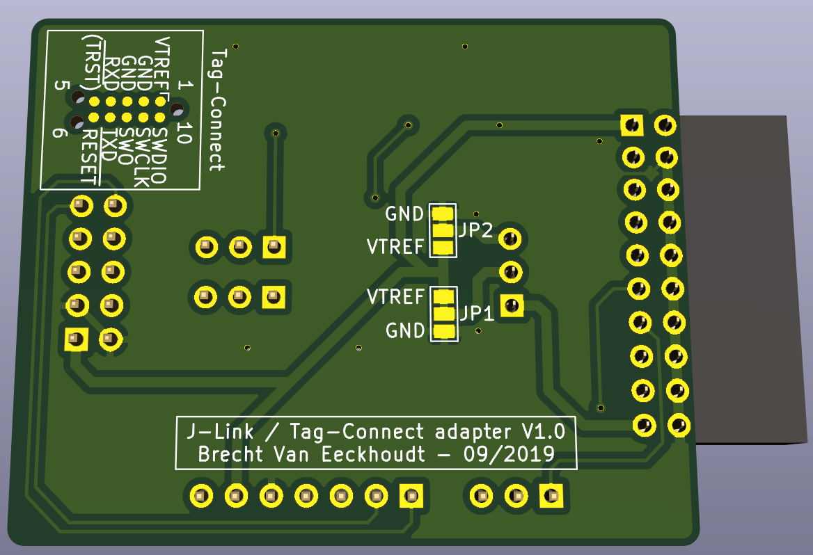

# jlink-tagConnect-adapter

 

 

 

- [Schematic](documentation/jlink-tagConnect-adapter.pdf)
- [Tag-Connect datasheet](documentation/TC2050-IDC-Datasheet.pdf)

 

## 1 - Usage

One can plug this *4cm x 5cm* adapter board in a [J-Link debugger](https://www.segger.com/products/debug-probes/j-link/models/j-link-base/) along with a [10 pin Tag-Connect adapter cable](http://www.tag-connect.com/TC2050-IDC) on the IDC connector. The cable will then have the approximate pinout (`RXD` instead of pin 7 `NC`) of the [standard 9-pin Cortex-M SWD/JTAG pinout](https://www.segger.com/products/debug-probes/j-link/accessories/adapters/9-pin-cortex-m-adapter/) from J-Link. The pinout of the Tag-Connect cable can be seen on the picure below (and for reference also on the bottom of the adapter board, but its pins aren't connected).

- **Pinheaders** `J1` and `J2` can be used to break out the SWD/JTAG pins to a 2.54mm standard header.
- **Pushbutton** `SW1` can be used to mannually **reset** the target board.
- A **DC-DC converter** can be plugged in on header `J4` to supply the target board with the correct voltage using the 5V supply of the J-Link programmer.
  - If the pinout of the converter doesn't match `VIN - VOUT - GND`, the last two pins can be changed around by swapping the solder joints on `JP1` and `JP2` on the bottom of the adapter. Then the pinout `VIN - GND - VOUT` will be selected.
- **Jumpers** `J6` and `J7` can also be used to swap some pinouts around. `J6` connects `pin 4` on the Tag-Connect cable to `RXD` or *doesn't connect it*. `J7` connects `pin 5` on the Tag-Connect cable to *nothing* or to `nTRST` (JTAG).

 

## 2 - BOM

|  Component  |  Value  |
| ---------- | --------- |
| J1 | 01x07 Male pinheader |
| J2 | 01x03 Male pinheader |
| J3 | 02x10 Female IDC connector ([DigiKey link](https://www.digikey.be/product-detail/en/sullins-connector-solutions/SFH11-PBPC-D10-RA-BK/S9205-ND/1990098))|
| J4 | 01x03 Female pinsocket |
| J5 | 02x05 Male IDC header |
| J6 | 01x03 Male pinheader (+ jumper) |
| J7 | 01x03 Male pinheader (+ jumper) |
| R1 | 1 kΩ 0805 Resistor |
| R2 | 100 Ω 0805 Resistor |
| C1 | 100 nF 0805 Capacitor |
| SW1 | 2 pin SPST tact switch |

 

## 3 - Layout guidelines for target board

It's advised to add the following passives on the target board for protection and stability:
- 100 kΩ pullup on `SWDIO`.
- 10 kΩ pullup on `RXD`.
- 100 Ω inline current limiting resistors on `TXD` and`RXD` lines.

 

## 4 - Future improvements

- Add RTCK signal to Tag-Connect cable pin 3 with jumper?
- Add standard (or modified with same jumpers) 0.05" (1,27mm) SWD 10-pin debug header?
- Omit reset button?
- Move Tag-Connect pinout from back to front.
- Add labels to headers (Tag-Connect & SDW 0.05")
- Add inline current measuring jumper
